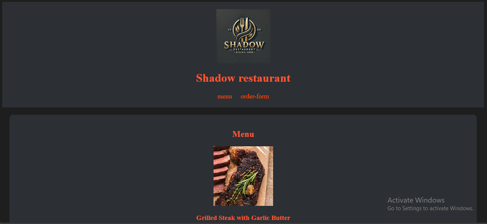

# Shadow Restaurant 🍽️  

This is my final project for the HTML course. It’s a simple restaurant website for **Shadow Restaurant**, featuring an interactive menu and an order form.  

## 🚀 Features  
- 📜 **Structured HTML:** Well-organized and semantic HTML structure.  
- 🎨 **Styled with CSS:** Modern design with smooth colors and clean layout.  
- 📋 **Order Form:** Allows users to place orders with quantity selection and special requests.  
- 🔗 **Navigation Menu:** Quick access to the menu and order form.  

## 🖥️ Technologies Used  
- **HTML5**  
- **CSS3**  

## 📸 Preview  

## 🔗 Live Demo  
[here](https://sh-algammal.github.io/restaurant-menu/)  

## 📌 Author  
Developed by [@Sh-algammal](https://github.com/Sh-algammal).  
